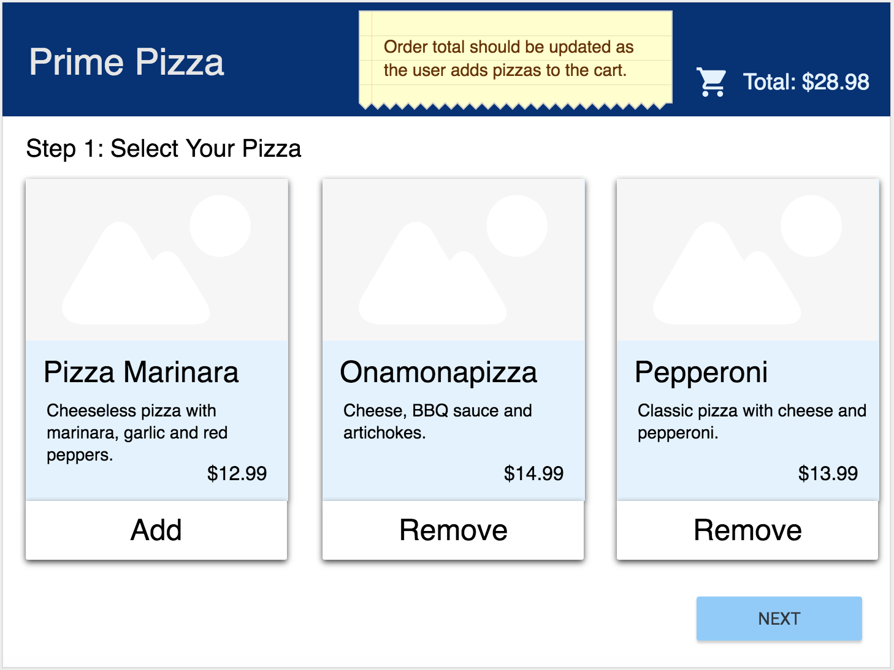
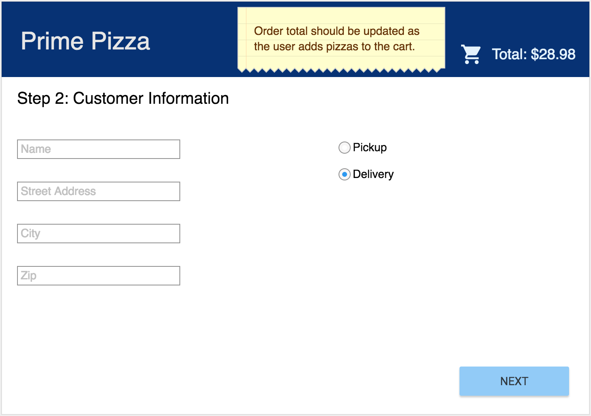
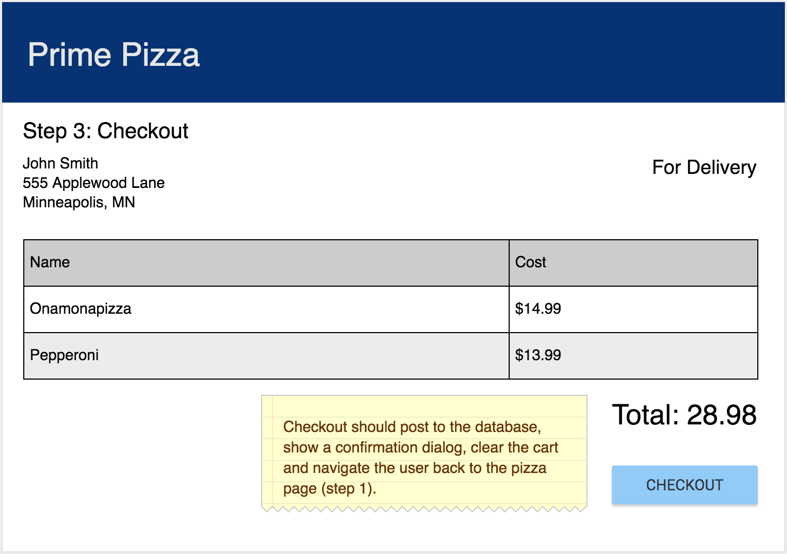
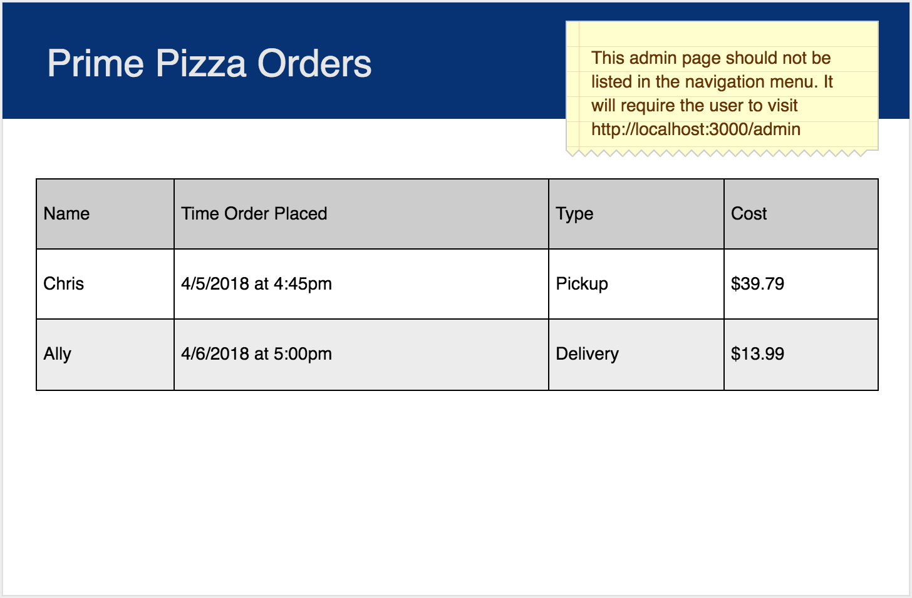

# React Pizza Parlor

Before you get started make sure to read through **ALL** requirements and outline a plan for your group. Assign out tasks and use branches to allow team members to work in parallel.

### Setup

Server side code for baseline functionality has been provided for you. Each member of your team will need to create a `pizza_parlor` database.

**Import data**

Right now, the owner enters all of the orders in SQL, but they want any of their employees to be able to enter a new order. The owner has provided some of the server side routes and a way to create their database with (`database.sql`). Your team should build out the following views.

**Start your server**

```
npm install
npm run server
```

Now that the server is running, open a new terminal tab with `cmd + t` and start the react client app.

**Start your client**

```
npm run client
```

## Base Mode ad API DOCS

The tasks for Base Mode are broken down further [on this Trello Board](https://trello.com/b/aWXfG8D6/redux-pizza-parlor). Take time before diving into the code to copy this board and build out the plan even further.

After starting up the server, the following routes should be available. You can test them with Postman.

### GET PIZZA  

`/api/pizza`

**Returns** an array of objects with *


*, *name*, *description*, *image_path* and *cost* properties. 

### POST ORDER

`/api/order`

**Post Data** should be an object that contains user information, *customer name*, *street address*, *city*, *zip*, *order_total* and an array of pizza id's as object. 

In Postman, select the Body tab, select Raw radio button, and then a blue dropdown appears and select JSON.

**Example JSON Post Data:**

```JSON
{
  "customer_name": "Donatello",
  "street_address": "20 W 34th St",
  "city": "New York",
  "zip": "10001",
  "total": "27.98",
  "type": "Pickup",
  "pizzas": [{
    "id": "1",
    "quantity": "1"
  },{
    "id": "2",
    "quantity": "1"
  }]
}
```

### GET ORDERS

`/api/order`

**Returns** an array of orders.


## BASE REQUIREMENTS

Your client has asked your team to build a pizza ordering system.

### ORDER - SELECT PIZZA

When visiting [http://localhost:3000/](http://localhost:3000/) display all of the pizzas on the screen. Allow users to add or remove each pizza they would like to order. **For base mode, only allow the user to have one of each pizza in their cart.** Show the total cost of items in the cart in the top right of this page. 

This page should have a next button that brings the user to the **enter order details page**.



### ORDER - ENTER CUSTOMER INFORMATION

Collect user information, *name*, *street address*, *city* and *zip*. This page should have an option to select pickup vs. delivery. The total cost of the order should appear in the top right of this page. This page should have a next button that brings the user to the **checkout** page.



### ORDER - CHECKOUT

Users should not be able to modify item totals on this screen. When they click checkout, the user information, order total and array of pizzas should be sent to the server. After the checkout is complete, navigate the user back to the **select pizza** page AND clear out the reducers as appropriate. Each order should begin with "clean" order data (cart, address, etc).



### ADMIN - ORDERS

This page **should not** appear in the navigation bar. Eventually the client would like to add authentication but for now, it will be available to anyone with the url [http://localhost:3000/admin](http://localhost:3000/admin). This page will display the name, time and order total for each of the orders placed.




## STRETCH GOALS

- Improve the styling of the app using Material-UI cards, buttons, nav bar and icons.
- Allow the user to go back to previous pages (until they've completed checkout).
- Display a list of pizzas for each order on the orders page.
- Add pictures to the `public/images` folder and update the image url for each pizza in the database.
- Add a button on the orders page to track delivery status.
- Allow admins to click on an order and see all of the details for that order (which pizzas were a part of that particular order). For the details of the order with `id` of `1`, it will be available to anyone with the url [http://localhost:3000/order/1](http://localhost:3000/order/1). This route is not built on the server, so you will need to create it.
